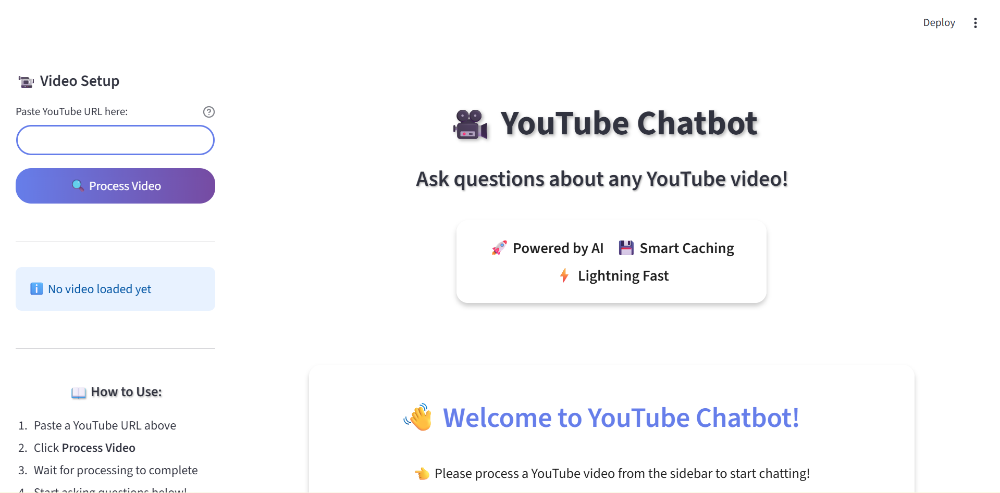
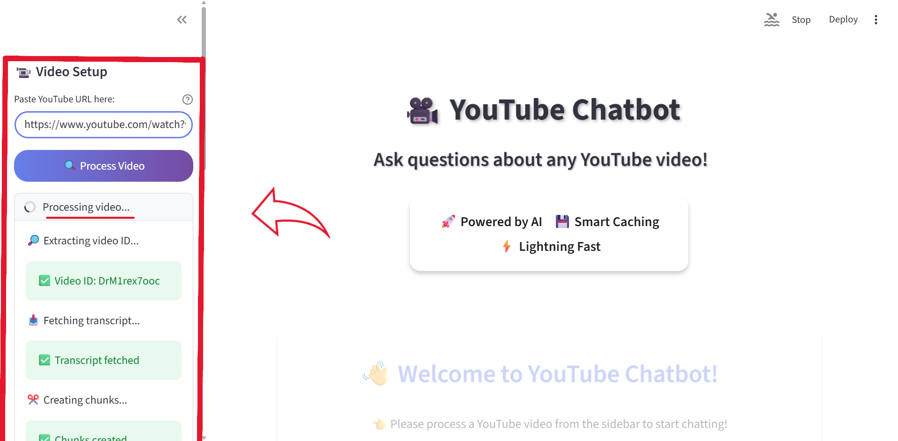
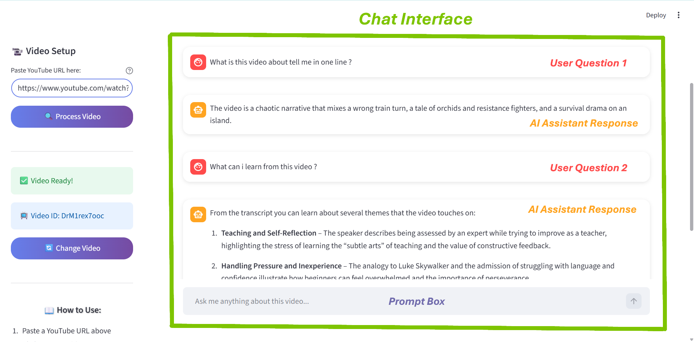

# 🎥 YouTube RAG Chatbot

> **Transform any YouTube video into an interactive Q&A experience using AI-powered Retrieval-Augmented Generation**

[](https://www.python.org/)
[](https://streamlit.io/)
[](https://www.langchain.com/)
[](https://openrouter.ai/)

---

## 📌 **Quick Navigation**

* [📖 About The Project](#-about-the-project)
* [✨ Key Features](#-key-features)
* [🛠️ Tech Stack](#️-tech-stack)
* [🚀 Quick Start Guide](#-quick-start-guide)
* [💡 How to Use](#-how-to-use)
* [📸 Screenshots](#-screenshots)
* [📌 Deployment Status & Access](#-deployment-status--access)
* [🏗️ Project Architecture](#️-project-architecture)
* [🔬 How It Works (Technical Deep Dive)](#-how-it-works-technical-deep-dive)
* [🎯 Key Components Explained](#-key-components-explained)
* [📊 Performance Metrics](#-performance-metrics)
* [🎓 Educational Value](#-educational-value)
* [🤝 Contributing](#-contributing)
* [🐛 Known Limitations](#-known-limitations)
* [🔮 Future Roadmap](#-future-roadmap)
* [📝 License](#-license)
* [👤 Author](#-author)
* [🙏 Acknowledgments](#-acknowledgments)
* [📧 Contact & Support](#-contact--support)
* [⭐ Show Your Support](#-show-your-support)

---

## 📖 **About The Project**

YouTube RAG Chatbot is an intelligent application that allows you to have **natural, context-aware conversations** about any YouTube video. Simply paste a YouTube URL, and the system processes the video's transcript using **RAG (Retrieval-Augmented Generation)** technology to provide accurate, grounded answers to your questions.

### **The Problem It Solves**

- ❌ **No more scrubbing through long videos** to find specific information
- ❌ **No more manual note-taking** while watching educational content
- ❌ **No more wondering** if a video covers the topics you're interested in

### **The Solution**

✅ **Instant answers** to any question about the video content  
✅ **Smart caching** - process once, query infinitely  
✅ **Accurate responses** - only answers based on actual video content (no hallucinations)  
✅ **Beautiful UI** - professional Streamlit interface with gradient design

---

## ✨ **Key Features**

| Feature | Description |
|---------|-------------|
| 🎥 **YouTube Integration** | Works with any YouTube video that has English transcripts |
| 🧠 **Intelligent Caching** | Processes each video once, stores embeddings for lightning-fast subsequent queries |
| 💬 **Independent Q&A Flow** | Ask multiple questions about the same video; each query is answered independently using retrieved transcript context |
| 🎯 **Grounded Answers** | Responses are strictly based on video content - no hallucinations |
| ⚡ **FAISS Vector Search** | Efficient semantic search using Facebook's FAISS library |
| 📊 **Persistent Storage** | Vector databases saved to disk - no re-processing needed |
| 🎨 **Modern UI** | Beautiful gradient interface with real-time processing feedback |
| 🔄 **Multi-Video Support** | Switch between different videos seamlessly |

---

## 🛠️ **Tech Stack**

### **Core Technologies**

```
Frontend:       Streamlit (Interactive Web UI)
Backend:        LangChain (RAG Framework)
Vector Store:   FAISS (Similarity Search)
Embeddings:     Sentence Transformers (all-MiniLM-L6-v2)
LLM:            OpenRouter API (GPT-OSS-20B)
Data Source:    YouTube Transcript API
```

### **Complete Dependency List**

| Category | Technologies |
|----------|-------------|
| **Web Framework** | Streamlit 1.53.0 |
| **RAG Framework** | LangChain, LangChain-Core, LangChain-Community, LangChain-OpenAI, LangChain-HuggingFace |
| **Vector Database** | FAISS (CPU version) |
| **Embeddings** | Sentence-Transformers, Transformers, PyTorch |
| **LLM Integration** | OpenAI SDK (via OpenRouter) |
| **Utilities** | Python-Dotenv, Requests, NumPy, tqdm |

---

## 🚀 **Quick Start Guide**

### **Prerequisites**

Before you begin, ensure you have:

- **Python 3.8+** installed ([Download here](https://www.python.org/downloads/))
- **OpenRouter API Key** ([Get free key here](https://openrouter.ai/keys))
- **Git** installed (optional, for cloning)

---

### **Installation Steps**

#### **1️⃣ Clone the Repository**

```bash
git clone https://github.com/KunjanMinama/YouTube-RAG-Chatbot.git
cd YouTube-RAG-Chatbot
```

---

#### **2️⃣ Create Virtual Environment**

**Windows:**
```bash
python -m venv yt_cb_rag
yt_cb_rag\Scripts\activate
```

**Mac/Linux:**
```bash
python3 -m venv yt_cb_rag
source yt_cb_rag/bin/activate
```

---

#### **3️⃣ Install Dependencies**

```bash
pip install -r requirements.txt
```

> ⏱️ **Installation takes ~2-3 minutes** (downloads PyTorch, transformers, etc.)

---

#### **4️⃣ Set Up Environment Variables**

**Create `.env` file:**

```bash
# Copy the example file
cp .env.example .env
```

**Edit `.env` and add your API key:**

```env
OPENROUTER_API_KEY=your_actual_openrouter_api_key_here
```

> 🔑 **Get your free API key:** [https://openrouter.ai/keys](https://openrouter.ai/keys)

---

#### **5️⃣ Run the Application**

```bash
streamlit run app.py
```

#### **6️⃣ Open in Browser**

The app will automatically open at:
```
http://localhost:8501
```

---

## 💡 **How to Use**

### **Step-by-Step Usage**

1. **📝 Paste YouTube URL**
   - Enter any YouTube video URL in the sidebar
   - Example: `https://www.youtube.com/watch?v=euCqAq6BRa4&list=RDeuCqAq6BRa4&start_radio=1&pp=oAcB`

2. **🔄 Process Video**
   - Click "🔍 Process Video" button
   - **First time:** ~30 seconds (downloads transcript, creates embeddings)
   - **Subsequent times:** ~2 seconds (loads from cache)

3. **💬 Ask Questions**
   - Type your question in the chat interface
   - Get instant, accurate responses

4. **🔁 Multiple Queries per Video**
   - Ask multiple independent questions about the same processed video without reprocessing it

### **Example Questions**

```
📌 General Understanding:
   - "What is this video about?"
   - "Summarize the main points in 3 sentences"
   - "What are the key takeaways?"

📌 Specific Information:
   - "Who are the speakers mentioned in this video?"
   - "What examples are given about machine learning?"
   - "Explain the concept of [specific topic] discussed"

📌 Relevance Checking:
   - "Is this video useful for data scientists?"
   - "Does this video cover Python programming?"
   - "What prerequisites are needed to understand this?"

📌 Deep Dive:
   - "What are the technical details about [topic]?"
   - "How does the speaker explain [concept]?"
   - "What tools or technologies are recommended?"
```

---

## 📸 **Screenshots**

### **Main Interface**
*Beautiful gradient UI with sidebar controls*



---

### **Video Processing**
*Real-time step-by-step processing feedback*



---

### **Chat Interface**
*Clean message bubbles with smooth interactions*



---

## 📌 Deployment Status & Access

This project is currently **not deployed as a public web application**, and this is a **deliberate design decision**.

### Why is it not publicly hosted?

- The application relies on **LLM API calls** via **OpenRouter**
- Although free-tier models are used, the API key has **strict rate and usage limits**
- Public deployment could lead to:
  - Rapid exhaustion of API limits
  - Potential key suspension due to uncontrolled public usage
  - Unexpected costs in production environments

### How is the project showcased instead?

- ✅ **Complete source code** is available in this repository
- ✅ **High-quality UI screenshots** are included above
- ✅ **A full demo video walkthrough** is shared (see below)

> This approach ensures the project can be safely evaluated from an **architecture, code quality, and UI/UX perspective**, without exposing private API credentials or violating usage limits.


---

## 🏗️ **Project Architecture**

### **File Structure**

```
youtube-rag-chatbot/
│
├── 📄 app.py                    # Streamlit frontend (UI + UX)
├── 🔧 rag_pipeline.py           # Core RAG logic (backend)
├── 📋 requirements.txt          # Python dependencies
├── 🔐 .env.example             # Environment variables template
├── 🚫 .gitignore               # Git ignore rules
├── 📖 README.md                # Project documentation (you're here!)
|
├── 📁 screenshots/             # Application UI screenshots used in README
│   ├── main_interface.png        # Main UI screen
│   ├── video_processing.png      # Video processing state
│   └── chat_interface.png        # Chat interaction view
│
├── 📁 vector_store/            # Cached embeddings (auto-generated)
│   └── [video_id]/            # One folder per processed video
│       ├── index.faiss        # FAISS vector index
│       └── index.pkl          # Metadata pickle file
│
├── 📁 yt_cb_rag/               # Virtual environment (not in git)
└── 📁 __pycache__/             # Python cache (not in git)
```

---

### **System Architecture Diagram**

```
┌─────────────────────────────────────────────────────────────────┐
│                         USER INTERFACE                          │
│                    (Streamlit Frontend)                         │
└────────────────────────────┬────────────────────────────────────┘
                             │
                             ▼
                    ┌────────────────┐
                    │  YouTube URL   │
                    └────────┬───────┘
                             │
                             ▼
┌─────────────────────────────────────────────────────────────────┐
│                    RAG PIPELINE (Backend)                       │
├─────────────────────────────────────────────────────────────────┤
│                                                                 │
│  1️⃣ VIDEO ID EXTRACTION                                        │
│     ├─ Regex pattern matching                                  │
│     └─ Returns: 11-character video ID                          │
│                                                                 │
│  2️⃣ TRANSCRIPT FETCHING                                        │
│     ├─ YouTube Transcript API                                  │
│     └─ Returns: Full text transcript                           │
│                                                                 │
│  3️⃣ TEXT CHUNKING                                              │
│     ├─ RecursiveCharacterTextSplitter                          │
│     ├─ Chunk size: 1000 characters                             │
│     ├─ Overlap: 200 characters                                 │
│     └─ Returns: A variable number of overlapping chunks        │
│                                                                 │
│  4️⃣ EMBEDDING GENERATION                                       │
│     ├─ Model: sentence-transformers/all-MiniLM-L6-v2           │
│     ├─ Creates 384-dim vectors                                 │
│     └─ Cached in: vector_store/[video_id]/                     │
│                                                                 │
│  5️⃣ VECTOR STORAGE (FAISS)                                     │
│     ├─ Persistent disk storage                                 │
│     ├─ Smart caching (load if exists)                          │
│     └─ Files: index.faiss + index.pkl                          │
│                                                                 │
│  6️⃣ QUERY PROCESSING                                           │
│     ├─ User question → Embedding                               │
│     ├─ Similarity search (k=4 chunks)                          │
│     ├─ Context formatting                                      │
│     └─ LLM prompt generation                                   │
│                                                                 │
│  7️⃣ LLM GENERATION                                             │
│     ├─ Model: OpenRouter (GPT-OSS-20B)                         │
│     ├─ Grounded prompting (transcript-only)                    │
│     └─ Returns: Accurate answer                                │
│                                                                 │
└─────────────────────────────────────────────────────────────────┘
                             │
                             ▼
                    ┌────────────────┐
                    │ Answer to User │
                    └────────────────┘
```

---

## 🔬 **How It Works (Technical Deep Dive)**

> This section is intended for readers interested in the internal working of the RAG pipeline.

### **Phase 1: Video Processing**

```python
# 1. Extract video ID from URL
video_id = extract_video_id("https://youtube.com/watch?v=...")
# Returns: "dQw4w9WgXcQ"

# 2. Fetch transcript
transcript = load_youtube_transcript(video_id)
# Returns: "Welcome to this video about AI..."

# 3. Split into chunks
chunks = create_chunks(transcript)
# Returns: [Document(1), Document(2), ..., Document(86)]
```

### **Phase 2: Embedding & Storage**

```python
# 4. Generate embeddings
embeddings = HuggingFaceEmbeddings(
    model_name="sentence-transformers/all-MiniLM-L6-v2"
)

# 5. Create/Load FAISS vector store
vector_store = get_or_create_vector_store(
    video_id=video_id,
    chunks=chunks,
    embedding_model=embeddings
)
# Saves to: vector_store/[video_id]/index.faiss
```

### **Phase 3: Query & Response**

```python
# 6. User asks question
user_question = "What is this video about?"

# 7. Retrieve relevant chunks
retriever = vector_store.as_retriever(search_kwargs={"k": 4})
relevant_docs = retriever.get_relevant_documents(user_question)

# 8. Generate answer using LLM
rag_chain = build_rag_chain(retriever)
answer = rag_chain.invoke(user_question)
# Returns: "This video discusses..."
```

> **Note:**
The code snippets above are a simplified, conceptual representation of the RAG pipeline for clarity.
In the actual implementation, these steps are encapsulated inside well-structured functions and LangChain runnables, each of which internally handles additional logic such as error handling, formatting, caching, and orchestration. For the most correct and best reference please refer the **rag_pipeline.py** file.

---

## 🎯 **Key Components Explained**

### **`rag_pipeline.py` - Core Backend Logic**

| Function | Purpose | Input | Output |
|----------|---------|-------|--------|
| `extract_video_id()` | Extracts 11-char video ID from URL | YouTube URL | Video ID string |
| `load_youtube_transcript()` | Fetches video transcript | Video ID | Full transcript text |
| `create_chunks()` | Splits text into overlapping chunks | Transcript | List of Documents |
| `get_or_create_vector_store()` | Loads cached or creates new vector DB | Video ID, Chunks, Embedding Model | FAISS vector store |
| `create_retriever()` | Creates similarity search retriever | Vector store | Retriever object |
| `build_rag_chain()` | Assembles complete RAG pipeline | Retriever | Runnable chain |
| `prepare_youtube_rag_chain()` | **Main orchestrator** - entry point | YouTube URL | Ready-to-use RAG chain |

---

### **`app.py` - Streamlit Frontend**

**Key Features:**

- 🎨 **Custom CSS:** Gradient backgrounds, rounded buttons, smooth animations
- 📊 **Session State Management:** Maintains chat history and video state
- ⏱️ **Real-time Feedback:** Step-by-step processing updates with spinners
- 💬 **Chat Interface:** Clean message bubbles with user/assistant distinction
- 🔄 **Video Switching:** Easy reset to process different videos
- 📱 **Responsive Design:** Works on desktop and mobile browsers

---

## 📊 **Performance Metrics**

| Operation | First Time | Cached |
|-----------|-----------|--------|
| **Video Processing** | ~30 seconds | ~2 seconds |
| **Question Response** | ~3-5 seconds | ~3-5 seconds |
| **Chunk Generation** | ~1 second | Instant (cached) |
| **Embedding Creation** | ~25 seconds | Instant (cached) |
| **Vector Search** | <100ms | <100ms |

### **Storage Details**

- **Chunk Size:** 1000 characters
- **Chunk Overlap:** 200 characters (20%)
- **Typical Chunks:** Varies based on transcript length, chunk size, and overlap configuration
- **Embedding Dimensions:** 384 (MiniLM-L6-v2)
- **Vector Store Size:** ~2-5 MB per video
- **Top-K Retrieval:** 4 most relevant chunks

---

## 🎓 **Educational Value**

This project demonstrates:

✅ **RAG Implementation** - Complete end-to-end pipeline  
✅ **Vector Databases** - FAISS for efficient similarity search  
✅ **Caching Strategy** - Persistent storage for performance optimization  
✅ **LLM Integration** - OpenRouter API with custom prompting  
✅ **Production Patterns** - Error handling, logging, modular design  
✅ **UI/UX Design** - Professional Streamlit interface with custom CSS  

---

## 🤝 **Contributing**

Contributions are **welcome**! Here's how you can help:

1. **🍴 Fork the repository**

2. **🌿 Create your feature branch:**
   ```bash
   git checkout -b feature/AmazingFeature
   ```

3. **💾 Commit your changes:**
   ```bash
   git commit -m 'Add some AmazingFeature'
   ```

4. **📤 Push to the branch:**
   ```bash
   git push origin feature/AmazingFeature
   ```

5. **🔀 Open a Pull Request**

> **NOTE:** This project is currently maintained as a personal portfolio project. Contributions are welcome, but may be reviewed and merged selectively.


### **Ideas for Contributions**

- 🌍 Multi-language support (beyond English)
- 📝 PDF export of chat conversations
- 🎙️ Audio transcript support
- 📊 Analytics dashboard for video insights
- 🔗 Playlist support (process multiple videos)
- 🎨 Theme customization options

---

## 🐛 **Known Limitations**

- ⚠️ **English Only:** Currently supports only English transcripts
- ⚠️ **Transcript Required:** Video must have captions/subtitles available
- ⚠️ **Processing Time:** First-time processing takes ~30 seconds per video
- ⚠️ **API Dependency:** Requires active OpenRouter API key
- ⚠️ **Storage:** Vector databases accumulate (2-5 MB per video)

---

## 🔮 **Future Roadmap**

I already have lots of plans in my mind for improving my Youtube Chatbot through correcting its known limitations and adding new functionalities from which some i have listed down :-

- [ ] Multi-language transcript support
- [ ] Timestamp citations in answers
- [ ] Video player integration (jump to relevant moments)
- [ ] Batch processing for playlists
- [ ] Export chat history to PDF/Markdown
- [ ] Custom embedding models selection
- [ ] Support for other video platforms (Vimeo, etc.)
- [ ] API endpoint for programmatic access

I have already started working on this and soon you will be seeing New Improvements & Updates in my project.

---


### **What this means:**

✅ Commercial use allowed  
✅ Modification allowed  
✅ Distribution allowed  
✅ Private use allowed  
⚠️ Warranty and liability limitations

---

## 👤 **Author**

**Kunjan Minama**

[](www.linkedin.com/in/kunjan-minama-1b023b342)
[](https://github.com/KunjanMinama)

---

## 🙏 **Acknowledgments**

Special thanks to the amazing open-source community:

- **[LangChain](https://langchain.com/)** - For the powerful RAG framework
- **[Streamlit](https://streamlit.io/)** - For making beautiful UIs simple
- **[OpenRouter](https://openrouter.ai/)** - For unified LLM API access
- **[FAISS](https://github.com/facebookresearch/faiss)** - For blazing-fast vector search
- **[Hugging Face](https://huggingface.co/)** - For pre-trained embedding models
- **[YouTube Transcript API](https://github.com/jdepoix/youtube-transcript-api)** - For transcript extraction

---


## ⭐ **Show Your Support**

If this project helped you or you found it interesting:

- ⭐ **Star this repository**
- 🍴 **Fork it for your own projects**
- 📢 **Share it with others**
- 💬 **Provide feedback**

---

## 📧 **Contact & Support**

**Have questions or suggestions?**

- 📧 **Email:** kunjanminama@gmail.com
- 💼 **LinkedIn:** [Kunjan Minama](www.linkedin.com/in/kunjan-minama-1b023b342)


---